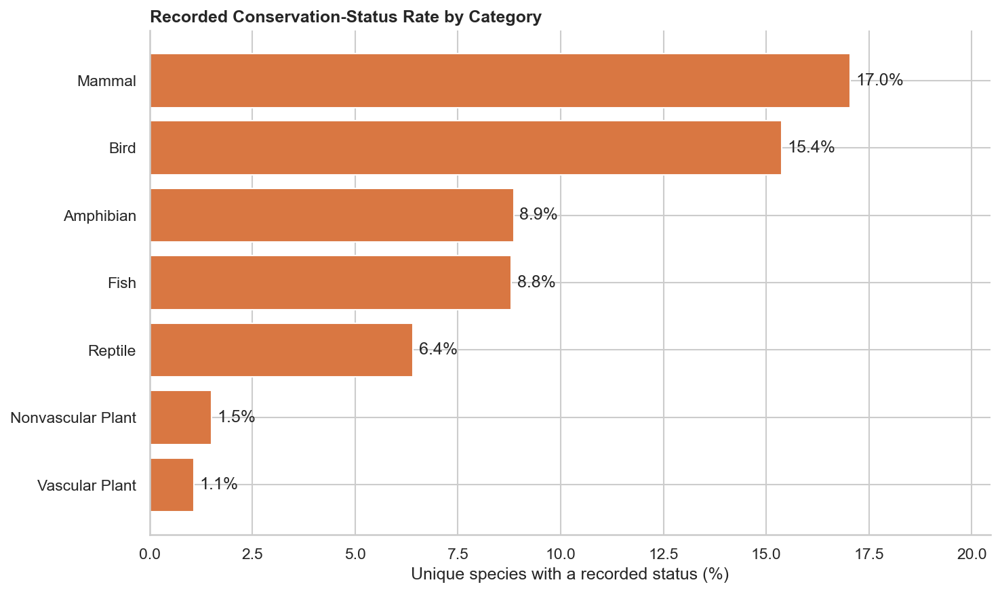
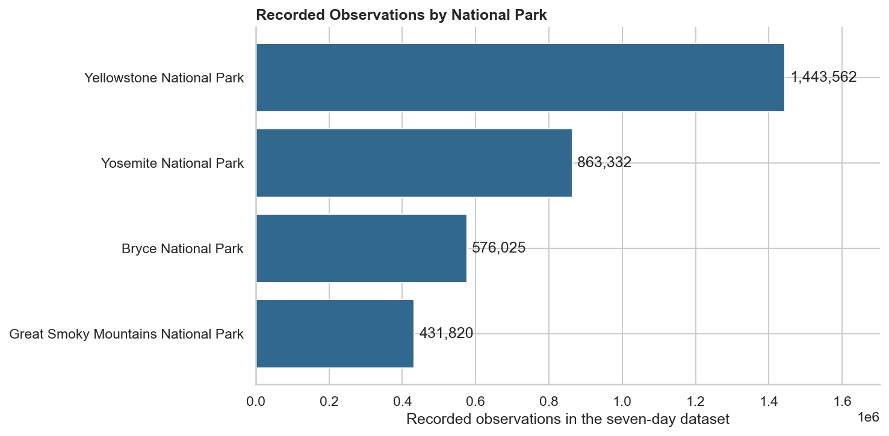
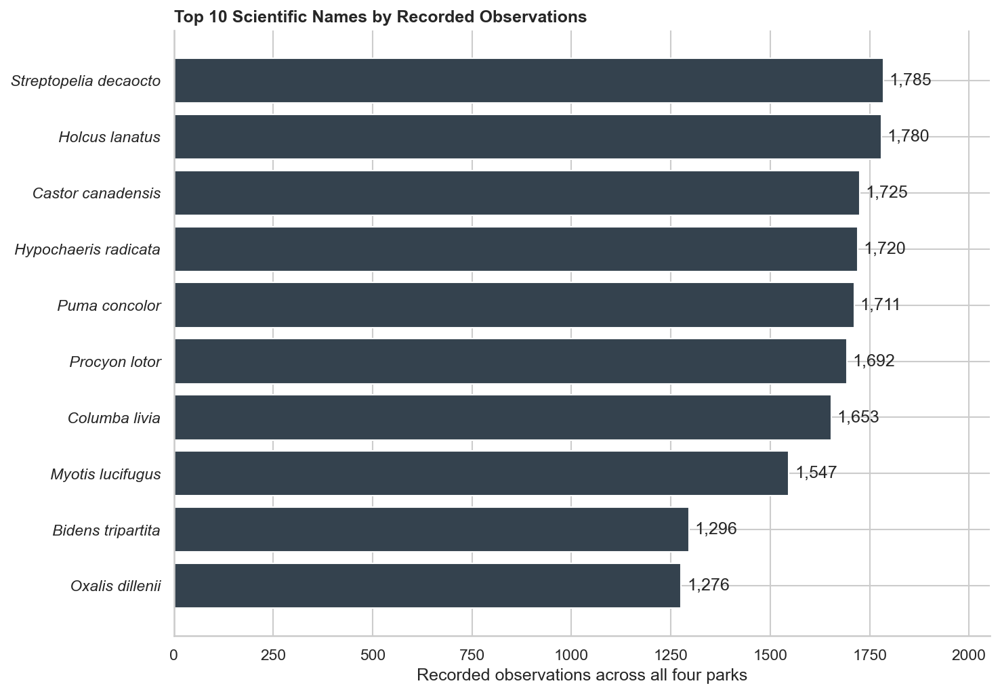

# Biodiversity and Conservation Analysis

## Overview

This project uses Python to analyze species and observation records associated with four United States national parks. It examines species composition, recorded conservation statuses, category-level conservation rates, and observation patterns while emphasizing data quality and safe dataset integration.

The analysis identified a many-to-many join problem that would have inflated recorded observations by **9.97%**. To prevent this, I created a canonical species table with one row per scientific name, aggregated observations to the species–park level, and validated the final merge.

> **Important:** The dataset is inspired by National Park Service information but is mostly fictional. The results demonstrate analytical methods and should not be used to make real conservation decisions.

## Questions

1. How many unique species are represented, and how are they distributed across biological categories?
2. How are recorded conservation statuses distributed?
3. Which categories have the highest percentage of species with a recorded status?
4. Do selected categories have statistically different recorded-status rates?
5. How do recorded observations vary across the four parks?
6. Could duplicate records or unsafe joins change the conclusions?

## Key findings

- The species file contains **5,824 records** representing **5,541 unique scientific names**.
- A total of **274 scientific names** occur more than once, and two have conflicting conservation statuses.
- A direct merge of the raw files increases the observation total from **3,314,739 to 3,645,247**, an inflation of **9.97%**.
- Vascular plants account for **4,262 species**, approximately **76.9%** of the unique species represented.
- **179 unique species (3.23%)** have a recorded conservation status. Species of Concern account for 151 of them.
- Mammals have the highest recorded-status rate at **17.05%**, followed by birds at **15.37%**.
- Mammal and bird rates are not statistically distinguishable in this dataset (`p = 0.630`).
- Mammals have approximately **2.66 times** the recorded-status rate of reptiles, but the result is suggestive rather than conclusive after correcting for two comparisons (adjusted `p = 0.058`).
- Yellowstone has the largest recorded observation total at **1,443,562**, but park size and survey effort are unavailable, so this is not a population or biodiversity ranking.
- *Streptopelia decaocto* has the highest species-level recorded total at **1,785 observations**.

## Visualizations

### Recorded conservation-status rate by category



Mammals and birds have the highest percentages of unique species with a recorded conservation status. These rates describe the supplied dataset, not the categories' true biological vulnerability.

### Recorded observations by park



Yellowstone has the largest recorded total. The comparison is descriptive because the data does not contain park area, survey effort, or detection probability.

### Top scientific names by recorded observations



These totals represent recorded observations across four parks rather than estimates of species abundance.

## Methodology

1. Inspected dataset shape, data types, categorical values, missingness, and numeric ranges.
2. Audited exact duplicates, repeated scientific names, conflicting statuses, candidate keys, and cross-file coverage.
3. Preserved the raw datasets and created a canonical table containing one row per scientific name.
4. Aggregated observations to one row per scientific-name and park combination.
5. Performed a validated many-to-one merge and confirmed that row counts and observation totals were preserved.
6. Calculated unique-species distributions and recorded-status rates by biological category.
7. Used Fisher's exact tests, risk ratios, confidence intervals, and a Bonferroni correction for selected category comparisons.
8. Created reproducible Matplotlib and Seaborn visualizations.

## Data-quality decisions

- Missing conservation statuses are labeled **No recorded status** rather than being interpreted as proof that a species has no conservation concern.
- Two scientific names have conflicting statuses. The canonical table retains the more conservative recorded status and flags the conflict.
- Repeated species–park observation records are aggregated by summing their counts.
- Fifteen exact observation rows are retained because no record identifier or timestamp is available to determine whether they are errors or legitimate repeated observations.
- Merge cardinality is explicitly validated to prevent silent row multiplication.

## Recommendations

- Maintain a species reference table with one row per scientific name and a unique species identifier.
- Add observation IDs, timestamps, survey methods, geographic coordinates, duration, area covered, and sampling effort.
- Store conservation-status sources, jurisdictions, effective dates, and status history.
- Normalize future park comparisons by survey effort and park area.
- Validate conservation priorities against current authoritative records before taking action.
- Automate tests for key uniqueness, accepted status values, observation validity, merge cardinality, and total preservation.

## Limitations

- The data is mostly fictional and covers only a seven-day observation period.
- It does not include dates, seasonal history, park area, survey effort, observation method, or detection probability.
- Observation counts may not represent unique individual organisms.
- Every scientific name appears in every park, limiting meaningful species-richness comparisons.
- The unresolved exact duplicates may affect observation totals.
- Statistical comparisons are exploratory and do not establish causality.

## Repository structure

```text
.
├── data/
│   ├── observations.csv
│   └── species_info.csv
├── figures/
│   ├── conservation_rate_by_category.png
│   ├── observations_by_park.png
│   ├── recorded_status_distribution.png
│   ├── species_by_category.png
│   └── top_10_species_observations.png
├── README.md
└── biodiversity.ipynb
```

## Tools

- Python
- pandas
- NumPy
- SciPy
- Matplotlib
- Seaborn
- Jupyter Notebook

## Running the project

1. Clone or download the repository.
2. Keep `observations.csv` and `species_info.csv` inside the `data` folder.
3. Install the required packages:

   ```bash
   python -m pip install pandas numpy scipy matplotlib seaborn jupyter
   ```

4. Start the notebook:

   ```bash
   jupyter notebook biodiversity.ipynb
   ```

5. Run all notebook cells from top to bottom.

The notebook uses paths relative to the repository root:

```python
from pathlib import Path

PROJECT_DIR = Path.cwd()
DATA_DIR = PROJECT_DIR / "data"

species_path = DATA_DIR / "species_info.csv"
observations_path = DATA_DIR / "observations.csv"
```

The charts are saved inside the `figures` folder:

```python
FIGURES_DIR = PROJECT_DIR / "figures"
FIGURES_DIR.mkdir(exist_ok=True)
```

## Data source

The project files were provided as part of a Codecademy learning project. The data is inspired by National Park Service information but is mostly fictional.
